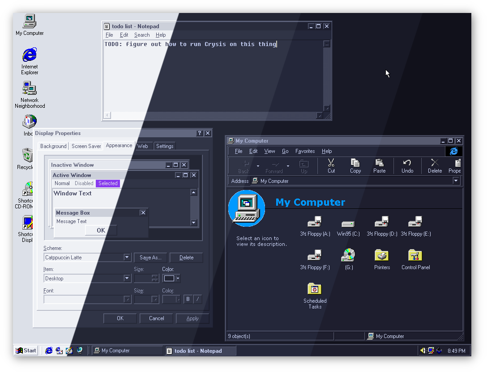
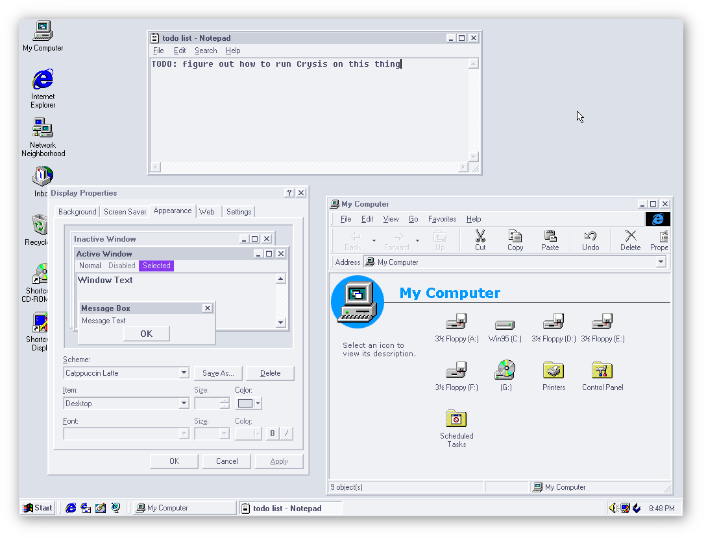
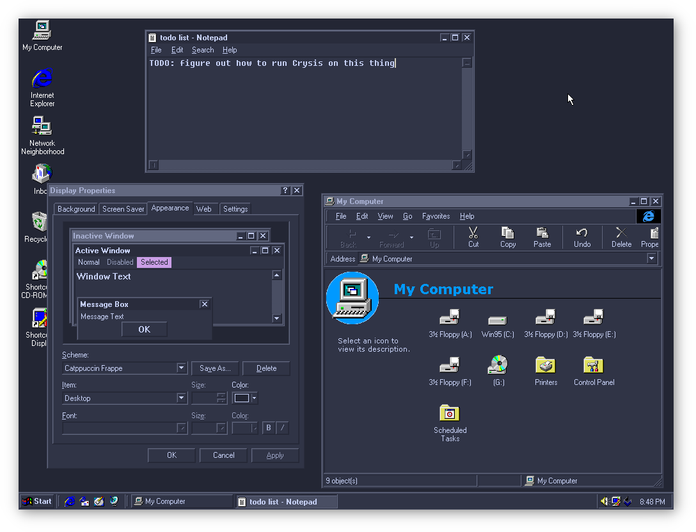
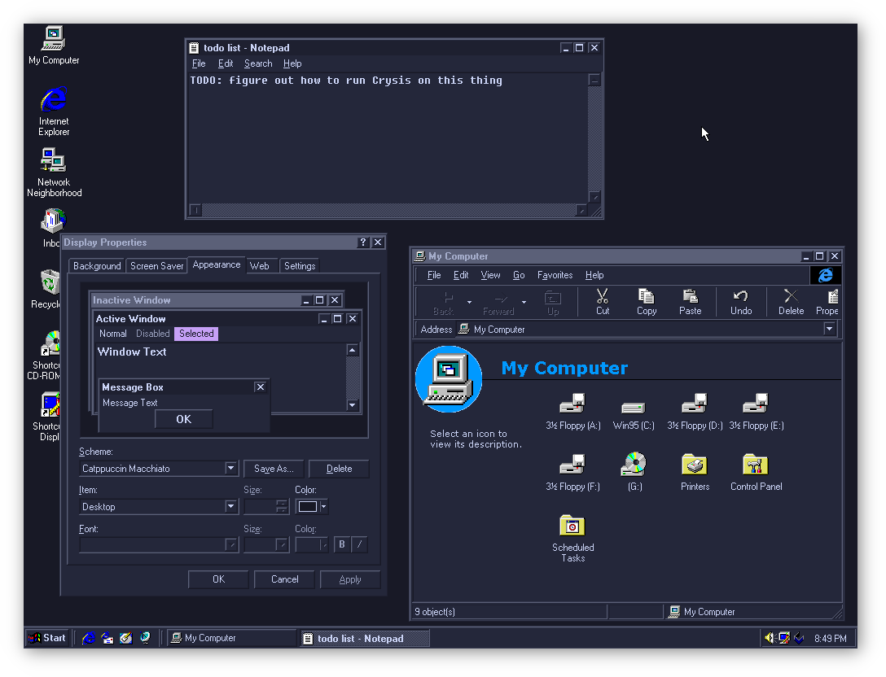
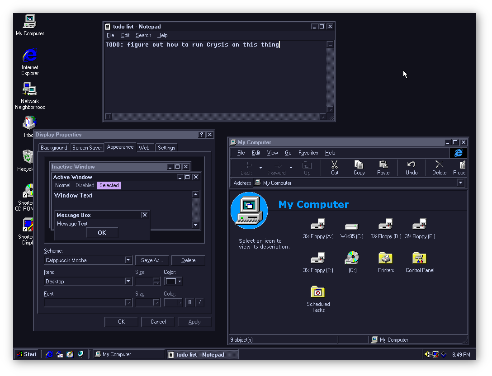

<h3 align="center">
	<br/>
	
	Catppuccin for <a href="https://en.wikipedia.org/wiki/Windows_9x">Windows 9x</a>
	
</h3>

<p align="center">
	<a href="https://github.com/catppuccin/windows9x/stargazers"></a>
	<a href="https://github.com/catppuccin/windows9x/issues"></a>
	<a href="https://github.com/catppuccin/windows9x/contributors"></a>
</p>

<p align="center">
	
</p>

## Previews

<details>
<summary>🌻 Latte</summary>

</details>
<details>
<summary>🪴 Frappé</summary>

</details>
<details>
<summary>🌺 Macchiato</summary>

</details>
<details>
<summary>🌿 Mocha</summary>

</details>

## Usage

> [!IMPORTANT]
> This theme is *only* compatible with Windows 95 and Windows 98.
> **Do not apply the registry entries on any other version of Windows**.

1. Download [`catppuccin.reg`](./themes/catppuccin.reg)
2. Double click it to install the registry entries
3. Navigate to Display Properties > Appearance and apply your chosen Catppuccin flavor

## Customization

This theme is built with [Whiskers](https://github.com/catppuccin/toolbox/tree/main/whiskers).

If you wish to change the accent color used for selected items, you can override it as follows:

```console
whiskers windows9x.tera --overrides '{"accent": "green"}'
```

Reinstall the rebuilt registry entries as described in [Usage](#usage).

For more extensive changes you can edit [windows9x.tera](./windows9x.tera) to change the theme variables and rebuild with `whiskers windows9x.tera`.

## 💝 Thanks to

- [pigeon](https://github.com/backwardspy)

&nbsp;

<p align="center">
	
</p>

<p align="center">
	Copyright &copy; 2021-present <a href="https://github.com/catppuccin" target="_blank">Catppuccin Org</a>
</p>

<p align="center">
	<a href="https://github.com/catppuccin/catppuccin/blob/main/LICENSE"></a>
</p>
